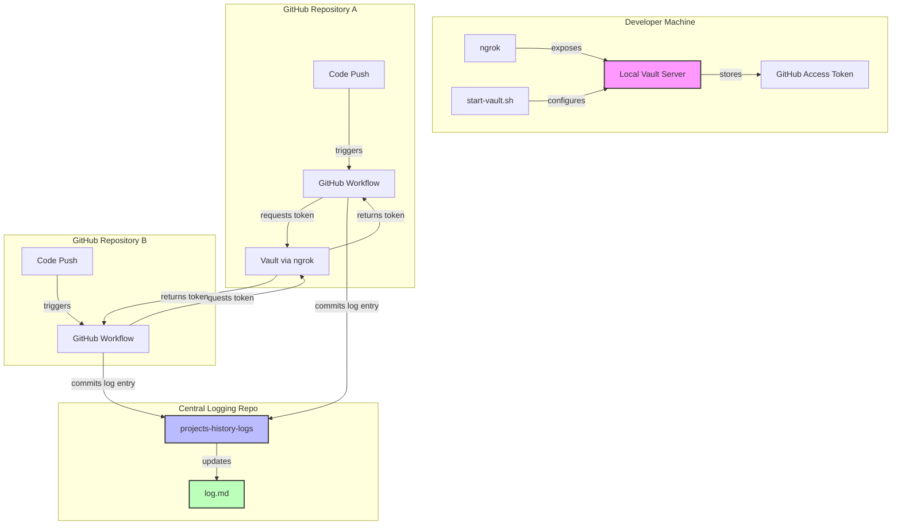

# Projects History Logs

A centralized logging system that tracks push events across multiple repositories using GitHub workflows and HashiCorp Vault for secure credential management.

## Prerequisites

Before setting up this logging system, ensure you have the following installed:

- **Docker** - Required to run the Vault server container
- **GitHub Personal Access Token** - For repository access and pushing logs 
- **Vault Token** - Add this to your repository secrets as `VAULT_TOKEN`
- **ngrok** - For exposing the local Vault server to GitHub Actions

## How to Use

1. **Configure environment variables**: Copy `.env.sample` to `.env` and fill in the necessary information including your ngrok URL, vault token, and GitHub access token details.

2. **Start the Vault server**: Run the `start-vault.sh` script to launch the Vault container and configure it with your GitHub access token. This script will also start ngrok to expose your local Vault instance.

3. **Deploy the workflow**: Copy the GitHub workflow file (`.github/workflows/log-push-events.yml`) to any repository you want to monitor. Each push to that repository will trigger the workflow and log the event to this central repository.

4. **Monitor activity**: Check the `log.md` file in this repository to see a chronological log of all push events across your monitored repositories.

## Architecture

## Key Benefits

**Centralized Tracking**: This system allows you to monitor development activity across multiple repositories from a single location. Instead of checking individual repositories for recent changes, you can view all push events in one centralized log.

**Secure Credential Management**: Rather than manually adding GitHub tokens to every repository's secrets, Vault acts as a centralized secret store. You only need to configure the vault token once per repository, and the system handles the rest.

**Easy Setup with ngrok**: The ngrok tunnel makes it simple to expose your local Vault server to GitHub Actions without complex networking configuration. This means you can run the entire system from your development machine.

**Scalable Monitoring**: As you add more repositories to monitor, simply copy the workflow file to each one. The system automatically handles logging from any number of repositories without additional configuration.

## Project Structure

- `scripts/start-vault.sh` - Initializes and configures the Vault server with ngrok
- `.github/workflows/log-push-events.yml` - GitHub workflow template for repositories to monitor
- `log.md` - Central log file containing all push events
- `.env.sample` - Environment configuration template